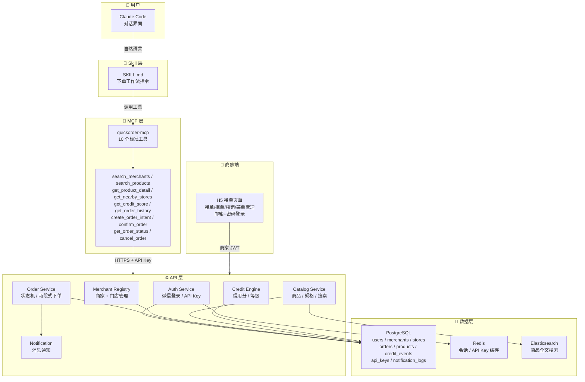

# 秒点 QuickOrder — 系统架构

```mermaid
flowchart TB
    subgraph User["👤 用户"]
        CC["Claude Code<br/>对话界面"]
    end

    subgraph Skill["🧠 Skill 层"]
        SKILL["SKILL.md<br/>下单工作流指令"]
    end

    subgraph MCP["🔌 MCP 层"]
        MCP_SVR["quickorder-mcp<br/>10 个标准工具"]
        TOOLS["search_merchants / search_products<br/>get_product_detail / get_nearby_stores<br/>get_credit_score / get_order_history<br/>create_order_intent / confirm_order<br/>get_order_status / cancel_order"]
    end

    subgraph API["⚙️ API 层"]
        AUTH["Auth Service<br/>微信登录 / API Key"]
        ORDER["Order Service<br/>状态机 / 两段式下单"]
        MERCHANT["Merchant Registry<br/>商家 + 门店管理"]
        CATALOG["Catalog Service<br/>商品 / 规格 / 搜索"]
        CREDIT["Credit Engine<br/>信用分 / 等级"]
        NOTIFY["Notification<br/>消息通知"]
    end

    subgraph Data["💾 数据层"]
        PG["PostgreSQL<br/>users / merchants / stores<br/>orders / products / credit_events<br/>api_keys / notification_logs"]
        CACHE["Redis<br/>会话 / API Key 缓存"]
        SEARCH["Elasticsearch<br/>商品全文搜索"]
    end

    subgraph Merchant["🏪 商家端"]
        H5["H5 接单页面<br/>接单/拒单/核销/菜单管理<br/>邮箱+密码登录"]
    end

    CC -->|"自然语言"| SKILL
    SKILL -->|"调用工具"| MCP_SVR
    MCP_SVR --> TOOLS
    TOOLS -->|"HTTPS + API Key"| API
    AUTH --> PG
    AUTH --> CACHE
    ORDER --> PG
    ORDER --> NOTIFY
    MERCHANT --> PG
    CATALOG --> PG
    CATALOG --> SEARCH
    CREDIT --> PG
    H5 -->|"商家 JWT"| API
```
